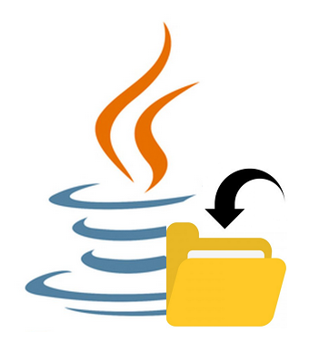

# JavaDFM

JavaDFM is a file management program that runs on the JRE.
# Prerequisites
You must have the JRE installed on your computer.
# Usage
JavaDFM can be run as a background task or as an app with a single cycle, depending on what you select at the start up dialog. If you choose to run it on a single cycle, it will work to sort out all of your current downloads and arrange them into the appropriate folders based on keywords within the file names. If you choose to run it as a background task, it'll continuously sort any content that you download onto your computer. 
